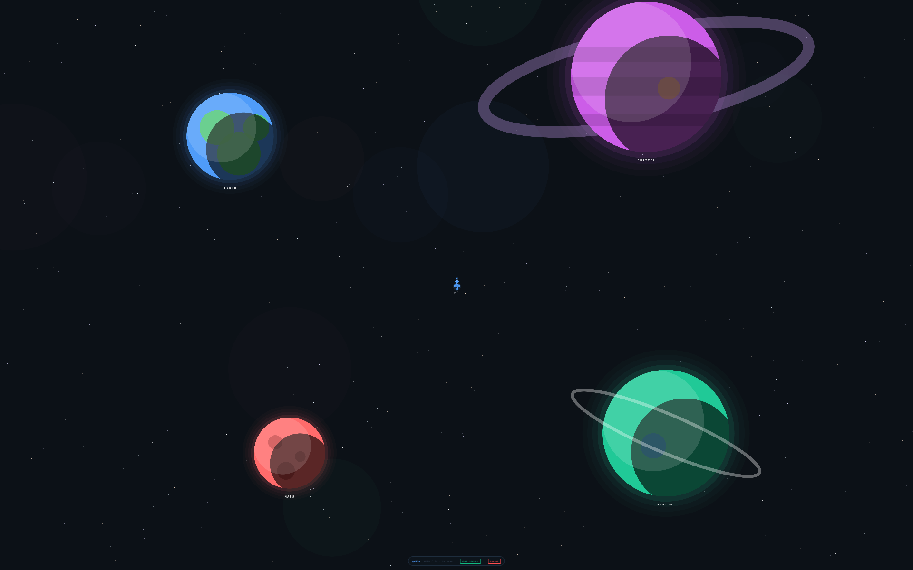
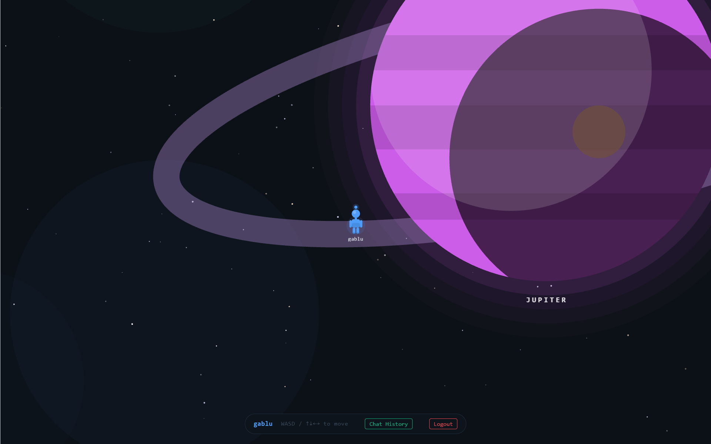

# 🌌 Proximity Chat — Virtual Cosmos

A real-time, multiplayer 2D world where players move around a shared canvas and **automatically start chatting when they walk near each other**. Built with a WebSocket-first architecture, Redis geospatial indexing, and a PixiJS game renderer.



> Walk up to someone → a chat room opens.  
> Walk away → it closes automatically and the transcript is saved.  
> No buttons, no lobbies — just proximity.



---

## Table of Contents

- [Architecture Overview](#architecture-overview)
- [Tech Stack](#tech-stack)
- [Backend](#backend)
  - [Directory Structure](#backend-directory-structure)
  - [Entry Point](#entry-point)
  - [Authentication System](#authentication-system)
  - [Auth Middleware](#auth-middleware)
  - [Database Layer](#database-layer)
  - [Redis — Geospatial Player Storage](#redis--geospatial-player-storage)
  - [Socket.IO Event Protocol](#socketio-event-protocol)
  - [Proximity Detection Engine](#proximity-detection-engine)
  - [Chat History API](#chat-history-api)
  - [Environment Variables](#environment-variables)
- [Frontend](#frontend)
  - [Directory Structure](#frontend-directory-structure)
  - [App Shell & Auth Flow](#app-shell--auth-flow)
  - [Persistent Auth — Zustand Store](#persistent-auth--zustand-store)
  - [API Client & Token Management](#api-client--token-management)
  - [Game Engine — CosmosGame](#game-engine--cosmosgame)
  - [Components](#components)
  - [Socket Integration](#socket-integration)
- [Getting Started](#getting-started)
- [Socket Event Reference](#socket-event-reference)

---

## Architecture Overview

```
┌─────────────────────────────────────────────────────────┐
│                      Frontend (Vite + React)            │
│                                                         │
│  authStore (Zustand) ← checkAuth() on mount             │
│         │  POST /api/auth/refresh (cookie)              │
│         ▼                                               │
│  LoginScreen / SignupScreen                             │
│         │  POST /api/auth/*                             │
│         ▼                                               │
│  GameCanvas ← PixiJS (CosmosGame)                       │
│         │  socket.emit('player:join / move')            │
│         │  socket.on('proximity:connect')               │
│         ▼                                               │
│  ChatRoom (appears on proximity)                        │
│  ChatHistoryPanel (toggle from HUD)                     │
└────────────────┬────────────────────────────────────────┘
                 │  WebSocket (Socket.IO)
                 │  HTTP REST (Express)
┌────────────────▼────────────────────────────────────────┐
│                      Backend (Node + Express)           │
│                                                         │
│  REST API ── /api/auth/login                            │
│           ── /api/auth/signup                           │
│           ── /api/auth/refresh                          │
│           ── /api/auth/logout          ← NEW            │
│           ── GET  /api/chats           ← NEW            │
│           ── POST /api/chats           ← NEW            │
│                                                         │
│  Socket.IO ── player:join / move / disconnect           │
│            ── proximity:connect / disconnect            │
│            ── chat:message                              │
│            ── player:sync_position     ← NEW            │
│                                                         │
│  ┌──────────────────┐  ┌───────────────────────────┐    │
│  │     MongoDB      │  │ Redis (Geospatial Index)   │    │
│  │  Users           │  │  GEOADD / GEOSEARCH        │    │
│  │  ChatHistory ←NEW│  │  Socket TTL keys (Lua CAS) │    │
│  └──────────────────┘  │  Active proximity pairs    │    │
│                        └───────────────────────────┘    │
└─────────────────────────────────────────────────────────┘
```

---

## Tech Stack

| Layer              | Technology                                      |
| ------------------ | ----------------------------------------------- |
| **Runtime**        | Node.js (ESM)                                   |
| **HTTP Server**    | Express 5                                       |
| **WebSocket**      | Socket.IO 4                                     |
| **Database**       | MongoDB (Mongoose 9)                            |
| **Cache / Geo**    | Redis (ioredis) — `GEOADD`, `GEOSEARCH`         |
| **Auth**           | JWT (access + refresh tokens), bcrypt           |
| **State Mgmt**     | Zustand 5                                       |
| **Frontend**       | React 19, Vite 8, TypeScript                    |
| **Game Renderer**  | PixiJS 8                                        |
| **Socket Client**  | socket.io-client 4                              |

---

## Backend

### Backend Directory Structure

```
backend/
├── .env                          # Environment variables
├── package.json
├── tsconfig.json
└── src/
    ├── index.ts                  # Express + Socket.IO bootstrap
    ├── api/
    │   ├── index.ts              # Route registration
    │   ├── auth/
    │   │   ├── login.ts          # POST /api/auth/login
    │   │   ├── signup.ts         # POST /api/auth/signup
    │   │   ├── refresh.ts        # POST /api/auth/refresh
    │   │   └── logout.ts         # POST /api/auth/logout  ← NEW
    │   └── chats/
    │       └── index.ts          # GET + POST /api/chats  ← NEW
    ├── controller/
    │   ├── login.ts              # Login business logic
    │   └── signup.ts             # Signup business logic
    ├── config/
    │   ├── config.ts             # Env vars + game constants
    │   └── jwt.ts                # Token generation & verification
    ├── db/
    │   ├── connection.ts         # Mongoose connect
    │   └── mongo.ts              # User + ChatHistory schemas
    ├── middleware/
    │   └── auth.ts               # authenticate() middleware  ← NEW
    ├── redis/
    │   └── index.ts              # ioredis client
    ├── data/
    │   ├── data.ts               # Player CRUD + socket TTL, validatePairs
    │   └── proximity.ts          # Proximity detection engine
    ├── socket/
    │   └── socket.ts             # Socket.IO event handlers
    └── types/
        └── player.ts             # TypeScript interfaces
```

---

### Entry Point

**`src/index.ts`** boots the server in three steps:

1. **MongoDB connection** — imported as a side-effect (`import "./db/connection.ts"`)
2. **Express middleware** — CORS (origin: `http://localhost:5173`), JSON body parser, cookie-parser
3. **Socket.IO server** — attached to the same HTTP server, CORS-enabled

The server listens on **port 3000**.

---

### Authentication System

A **two-token JWT architecture** secures the API:

| Token           | Storage           | Lifetime | Purpose                             |
| --------------- | ----------------- | -------- | ----------------------------------- |
| **Access**      | In-memory (JS)    | 15 min   | Sent in `Authorization` header      |
| **Refresh**     | HttpOnly cookie   | 7 days   | Used only to mint new access tokens |

#### Endpoints

##### `POST /api/auth/signup`

Creates a new user account.

```json
// Request
{
  "username": "nova",
  "password": "s3cret"
}

// Response 200
{
  "accessToken": "eyJhbG...",
  "user": { "username": "nova" }
}
// + Set-Cookie: refreshToken=...; HttpOnly; SameSite=Strict
```

- Password is hashed with **bcrypt** (10 salt rounds) before storage.
- `username` must be unique.

##### `POST /api/auth/login`

Authenticates an existing user.

```json
// Request
{ "username": "nova", "password": "s3cret" }

// Response 200
{
  "accessToken": "eyJhbG...",
  "user": { "username": "nova" }
}
```

##### `POST /api/auth/refresh`

Reads the `refreshToken` cookie, verifies it, and returns a fresh access token **along with the username** — used by the Zustand `checkAuth()` call on app load to restore session without re-logging in.

```json
// Response 200
{ "accessToken": "eyJhbG...", "username": "nova" }
```

##### `POST /api/auth/logout`

Clears the `refreshToken` cookie server-side, effectively ending the session.

```json
// Response 200
{ "message": "Logged out" }
```

---

### Auth Middleware

**`src/middleware/auth.ts`** exports `authenticate` — an Express middleware that guards protected routes.

```ts
export const authenticate = (req: AuthRequest, res: Response, next: NextFunction): void => {
  // 1. Extract Bearer token from Authorization header
  // 2. Call verifyAccessToken()
  // 3. Attach decoded { username } to req.user
  // 4. On failure → 401 / 403
};
```

Used by the `/api/chats` router to ensure only the logged-in user can read or write their own chat history.

---

### Database Layer

#### MongoDB — User Model

| Field      | Type   | Constraints      |
| ---------- | ------ | ---------------- |
| `username` | String | required, unique |
| `password` | String | required (hashed)|
| `x`        | Number | default: 0       |
| `y`        | Number | default: 0       |

> **Note:** `userId` and `socketId` fields have been removed from the schema. Players are now uniquely identified by their `username` across both Redis and Socket.IO.

#### MongoDB — ChatHistory Model

Stores chat transcripts when two players move out of proximity range.

| Field          | Type     | Description                                |
| -------------- | -------- | ------------------------------------------ |
| `participants` | String[] | Usernames of the two players               |
| `messages`     | Array    | `{ sender, content, timestamp }` per message |

Connection string is read from `MONGO_URI` in `.env`.

---

### Redis — Geospatial Player Storage

Player positions live in Redis for O(log N) proximity queries:

| Operation           | Redis Command       | Description                                    |
| ------------------- | ------------------- | ---------------------------------------------- |
| Add / update player | `GEOADD`            | Stores `(lon, lat)` mapped from game `(x, y)`  |
| Remove player       | `ZREM`              | Removes member from the geo sorted set          |
| Get all positions   | `ZRANGE` + `GEOPOS` | Fetches every player's coordinates             |
| Proximity search    | `GEOSEARCH`         | Finds all players within the proximity radius  |

**Coordinate mapping:** Game pixel coordinates are divided by `GEO_SCALE` (111,320 — roughly meters-per-degree at the equator) to produce valid lon/lat values for Redis geo commands.

**Member key:** Each player is stored by `username` directly — no longer as `socketId:username`.

**Socket TTL keys:** Each connected player's `socketId` is stored in `socket:<username>` with a configurable TTL (`SOCKET_TTL`). This auto-expires ghost entries if the server crashes unexpectedly.

**Lua CAS (Compare-And-Delete):** `removeSocketMapping` uses an atomic Lua script to only delete the socket key if its value still matches the disconnecting socket's ID. This prevents a late-arriving disconnect handler from wiping a key that was already overwritten by a fresh reconnect.

**Active pairs:** Proximity sessions are tracked in Redis Sets (`proximity:active-pairs:<username>`), enabling the server to know which rooms to tear down on disconnect.

---

### Socket.IO Event Protocol

All real-time game communication flows through Socket.IO. See the full [Event Reference](#socket-event-reference) below.

**Connection lifecycle:**

1. Client authenticates via REST (or `checkAuth` restores session from cookie)
2. Client connects to Socket.IO → emits `player:join`
3. Server checks for a **ghost socket** (previous tab/refresh) and disconnects it
4. Server resumes the player's last known position from Redis; emits `player:sync_position` if found
5. Server calls `validatePairs` to clear any stale proximity entries left over from a crash
6. On each movement frame → `player:move` → server updates Redis, runs proximity check, broadcasts
7. On disconnect → guard against reconnect race (Lua CAS), cleanup from Redis, notify peers, tear down proximity rooms

---

### Proximity Detection Engine

**`src/data/proximity.ts`** runs on every `player:move` and `player:join` event:

```
              player:move / player:join
                      │
            ┌─────────▼──────────┐
            │   GEOSEARCH 130m   │  ← find everyone within PROXIMITY_RADIUS
            └─────────┬──────────┘
                      │
          ┌───────────▼───────────┐
          │  Compare with active  │  ← Redis Set of current partners
          │  pairs from Redis     │
          └───┬────────────┬──────┘
              │            │
     ┌────────▼──┐   ┌────▼────────┐
     │  NEW pair │   │  LOST pair  │
     │  (enter)  │   │  (exit)     │
     └────┬──────┘   └────┬────────┘
          │               │
  proximity:connect  proximity:disconnect
  + join Socket room  + leave Socket room
```

**Key behaviors:**
- **One-to-one rooms only:** Each player can be in at most **one** proximity chat at a time. If either player is already engaged, the new proximity event is skipped. This prevents a third player from forcing their way into an existing chat.
- When two players enter each other's radius → both receive `proximity:connect` with a shared `roomId`
- When they move apart → both receive `proximity:disconnect`
- The `roomId` is deterministic: `room:<sortedUsername1>:<sortedUsername2>`
- Chat messages are scoped to this room via `socket.to(roomId).emit(...)`
- On player disconnect → `deletePlayerFromProximity` tears down all of that player's active rooms and notifies their partners

---

### Chat History API

When players move out of proximity range, the frontend saves the session transcript. The backend provides two protected endpoints (both require a valid access token):

#### `GET /api/chats`

Returns all chat sessions where the logged-in user was a participant, sorted newest-first.

```json
// Response 200
[
  {
    "_id": "...",
    "participants": ["nova", "orion"],
    "messages": [
      { "sender": "nova", "content": "Hey!", "timestamp": "2026-04-07T...", "_id": "..." }
    ]
  }
]
```

#### `POST /api/chats`

Saves a new chat session. The server validates that the logged-in user is listed in `participants`.

```json
// Request
{
  "participants": ["nova", "orion"],
  "messages": [
    { "sender": "nova", "content": "Hey!", "timestamp": "..." },
    { "sender": "orion", "content": "Hi!", "timestamp": "..." }
  ]
}

// Response 201
{ "success": true, "historyId": "..." }
```

---

### Environment Variables

Create a `backend/.env` file:

```env
MONGO_URI=mongodb+srv://<user>:<pass>@<cluster>/<dbname>
REDIS_HOST=127.0.0.1
REDIS_PORT=6379
JWT_SECRET=<your-access-token-secret>
JWT_REFRESH_SECRET=<your-refresh-token-secret>
ACCESS_TOKEN_EXPIRATION=3600
REFRESH_TOKEN_EXPIRATION=72000
```

---

## Frontend

### Frontend Directory Structure

```
frontend/
├── index.html
├── package.json
├── vite.config.ts
├── tsconfig.json / tsconfig.app.json / tsconfig.node.json
├── constants/
│   └── gameConstants.ts          # World size, speed, proximity radius, zones
├── game/
│   ├── CosmosGame.ts             # PixiJS game engine class
│   └── gameHelper.ts             # Color picker utility
├── lib/
│   └── socket.ts                 # Socket.IO client instance
├── types/
│   ├── gameTypes.ts              # Avatar, Position, Zone interfaces
│   ├── player.ts                 # PlayerData, MoveData, UserData
│   └── chat.ts                   # ChatMessage, ChatRoomProps
├── styles/
│   ├── style.ts                  # Auth screen styles
│   └── chatStyle.ts              # Chat panel + history panel styles
└── src/
    ├── main.tsx                  # React entry point
    ├── App.tsx                   # Root component — auth + game + chat
    ├── App.css
    ├── index.css
    ├── lib/
    │   └── api.ts                # fetchWithAuth + token management
    ├── store/
    │   └── authStore.ts          # Zustand auth store  ← NEW
    └── components/
        ├── LoginScreen.tsx       # Login form
        ├── SignupScreen.tsx       # Signup form
        ├── GameCanvas.tsx        # PixiJS mount + lifecycle
        ├── ChatRoom.tsx          # Live proximity chat panel
        └── ChatHistoryPanel.tsx  # Past chat sessions viewer  ← NEW
```

---

### App Shell & Auth Flow

**`App.tsx`** delegates authentication state to `useAuthStore` and manages the overall screen hierarchy:

```
                    mount
                      │
              checkAuth() ──────────────────────────────▶ "Loading cosmos..."
                      │  (POST /api/auth/refresh cookie)
                      │
           ┌──────────▼──────────┐
           │  username?          │
           └──┬──────────────┬───┘
         null │              │ set
              ▼              ▼
    ┌─────────────────┐  ┌──────────────────────────────┐
    │ LoginScreen  or │  │  GameCanvas + HUD             │
    │ SignupScreen    │  │  ├── ChatRoom (on proximity)  │
    └─────────────────┘  │  └── ChatHistoryPanel (toggle)│
                         └──────────────────────────────┘
```

**HUD controls:**
- Displays the current **username**
- **WASD / Arrow** movement hint
- **"Chat History"** button — toggles `ChatHistoryPanel`
- **"Logout"** button — calls `POST /api/auth/logout`, clears the in-memory token, and resets Zustand state

---

### Persistent Auth — Zustand Store

**`src/store/authStore.ts`** manages the global authentication state using **Zustand**.

```ts
const { username, isCheckingAuth, checkAuth, login, logout } = useAuthStore();
```

| Action / State   | Description                                                                 |
| ---------------- | --------------------------------------------------------------------------- |
| `isCheckingAuth` | `true` on first load while the refresh-token check is in flight             |
| `checkAuth()`    | Calls `POST /api/auth/refresh` (with cookie), restores `username` + token  |
| `login()`        | Stores the access token in memory, sets `username`                         |
| `logout()`       | Clears the access token, resets `username` to `null`                       |

`checkAuth()` is called once in `App.tsx` inside a `useEffect` on mount, enabling **seamless session persistence** across page refreshes without requiring re-login if the refresh token is still valid.

---

### API Client & Token Management

**`src/lib/api.ts`** provides `fetchWithAuth()` — a wrapper around `fetch` that:

1. Attaches the **access token** as a `Bearer` header
2. On **401 response**, automatically calls `POST /api/auth/refresh` to get a new access token
3. **Retries** the original request with the new token
4. If refresh fails → clears token and throws `"Session expired"`

```ts
const res = await fetchWithAuth('/chats', {
  method: 'POST',
  body: JSON.stringify({ participants, messages })
});
```

---

### Game Engine — CosmosGame

**`game/CosmosGame.ts`** is the core PixiJS game engine class. It manages:

| Responsibility            | Details                                                |
| ------------------------- | ------------------------------------------------------ |
| **Canvas init**           | Creates a PixiJS `Application`, attaches to the DOM    |
| **World rendering**       | Draws an infinite-feel grid with dot intersections     |
| **Room zones**            | Renders labeled rectangular zones (Lounge, War Room, Cafeteria) |
| **Player avatar**         | Circle + halo + username label + proximity ring        |
| **Keyboard input**        | WASD / Arrow keys, diagonal normalization (×0.7071)    |
| **Game loop**             | 60fps tick — moves player, lerps remote players, fires callbacks |
| **Camera**                | Follows local player (centered on screen)              |
| **Remote players**        | Smooth interpolation via `lerp(0.14)` toward target positions |
| **Proximity ring**        | Dashed circle around the local player showing detection range |

#### Game Constants

| Constant           | Value  | Description                             |
| ------------------ | ------ | --------------------------------------- |
| `WORLD_SIZE`       | 4000   | Grid extends ±4000 pixels               |
| `WORLD_BOUND`      | 1900   | Player movement clamped to ±1900        |
| `GRID_STEP`        | 64     | Grid line spacing in pixels             |
| `PLAYER_SPEED`     | 3.2    | Pixels/frame base speed                 |
| `PROXIMITY_RADIUS` | 130    | Pixel radius for proximity detection    |

#### Public API

```ts
game.addPlayer(id, x, y, username)    // Add a remote player to the world
game.movePlayer(id, x, y)             // Update a remote player's target position
game.removePlayer(id)                 // Remove a remote player
game.getNearbyPlayerIds()             // Get IDs of players within proximity radius
game.destroy()                        // Cleanup — removes listeners, destroys PixiJS app
```

#### Callbacks

```ts
game.onMove = (x, y) => { ... }           // Fires each frame the local player moves
game.onProximity = (nearbyIds) => { ... }  // Fires each tick with nearby player IDs
```

---

### Components

#### `LoginScreen`

- Form with **username** and **password** fields
- Calls `POST /api/auth/login` via `fetchWithAuth`
- On success, calls `useAuthStore.login(username, token)` to persist state
- Animated **shake** effect on validation error
- Link to switch to signup

#### `SignupScreen`

- Same structure as login
- Calls `POST /api/auth/signup` (password hashed server-side)
- On success, calls `useAuthStore.login(username, token)`

#### `GameCanvas`

- Mounts a `<div>` and initializes `CosmosGame` inside it
- Uses `useRef` for stable game instance across re-renders
- Calls `onReady(game)` once PixiJS is initialized
- Cleans up on unmount (`game.destroy()`)

#### `ChatRoom`

- **Appears** when `proximityState` is set (i.e., `proximity:connect` received)
- **Disappears** when `proximity:disconnect` fires
- Real-time messaging via `chat:message` socket event
- Optimistic message rendering (shows immediately, emits to server)
- On close/disconnect, saves the session via `POST /api/chats`
- Auto-scrolls to the latest message
- Styled as a floating panel overlaying the game

#### `ChatHistoryPanel` *(new)*

- Toggled from the in-game HUD's **"Chat History"** button
- Fetches all past sessions via `GET /api/chats` (authenticated)
- Displays each session as a card: **partner's username**, **date**, and full message log
- Shows a "No past encounters found." empty state
- Styled as a floating overlay panel

---

### Socket Integration

Socket events are wired in `App.tsx` inside the `handleGameReady` callback:

| Event                   | Direction         | Payload                                          | Action                              |
| ----------------------- | ----------------- | ------------------------------------------------ | ----------------------------------- |
| `player:join`           | Client → Server   | `{ username, x, y }`                            | Register in Redis, validate pairs   |
| `player:sync_position`  | Server → Client   | `{ x, y }`                                      | Snap game avatar to resumed position |
| `players:init`          | Server → Client   | `PlayerData[]`                                   | Render existing players             |
| `player:joined`         | Server → Client   | `{ id, x, y, username }`                         | Add remote avatar                   |
| `player:move`           | Client → Server   | `{ x, y }`                                      | Update position in Redis            |
| `player:moved`          | Server → Client   | `{ id, x, y }`                                  | Lerp remote avatar                  |
| `player:left`           | Server → Client   | `{ id }`                                        | Remove avatar                       |
| `proximity:connect`     | Server → Client   | `{ userId, roomId }`                             | Open ChatRoom                       |
| `proximity:disconnect`  | Server → Client   | `{ userId, roomId }`                             | Close ChatRoom, save history        |
| `chat:message`          | Bidirectional     | `{ roomId, message }` / `{ senderId, message }` | Send/receive chat                   |

---

## Getting Started

### Prerequisites

- **Node.js** ≥ 18
- **Redis** server running on `localhost:6379`
- **MongoDB** instance (local or Atlas)

### 1. Clone & Install

```bash
git clone https://github.com/pradeepsingh2025/proximity-chat.git
cd proximity-chat
```

### 2. Backend Setup

```bash
cd backend
npm install
```

Create a `.env` file (see [Environment Variables](#environment-variables)).

Start the server:

```bash
node src/index.ts
```

The backend starts on **http://localhost:3000**.

### 3. Frontend Setup

```bash
cd frontend
npm install
npm run dev
```

The frontend starts on **http://localhost:5173**.

### 4. Play

1. Open **two browser tabs** at `http://localhost:5173`
2. Sign up / log in with different usernames in each tab
3. Move your avatars toward each other using **WASD** or **Arrow keys**
4. When the avatars are within 130px — a **chat panel** appears automatically
5. Send messages back and forth in real time
6. Walk away — the chat closes and the transcript is saved
7. Click **"Chat History"** in the HUD to review past encounters

---

## Socket Event Reference

### Client → Server

| Event          | Payload                | Description                                |
| -------------- | ---------------------- | ------------------------------------------ |
| `player:join`  | `{ username, x, y }`  | Register player in the world               |
| `player:move`  | `{ x, y }`            | Report new position (every movement frame) |
| `chat:message` | `{ roomId, message }` | Send a chat message to a proximity room    |

### Server → Client

| Event                  | Payload                                         | Description                                       |
| ---------------------- | ----------------------------------------------- | ------------------------------------------------- |
| `players:init`         | `PlayerData[]`                                  | Full world state sent to a newly joined player    |
| `player:joined`        | `{ id, x, y, username }`                        | A new player entered the world                    |
| `player:moved`         | `{ id, x, y }`                                  | A player changed position                         |
| `player:left`          | `{ id }`                                        | A player disconnected                             |
| `player:sync_position` | `{ x, y }`                                      | Resume position after reconnect/refresh           |
| `proximity:connect`    | `{ userId, roomId }`                            | You entered another player's proximity            |
| `proximity:disconnect` | `{ userId, roomId }`                            | You left another player's proximity               |
| `chat:message`         | `{ senderUsername, message }`                         | Incoming chat message in a proximity room         |

---

## License

This project is open source and available under the [ISC License](https://opensource.org/licenses/ISC).
